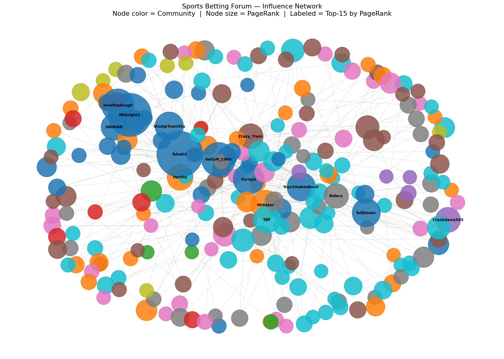
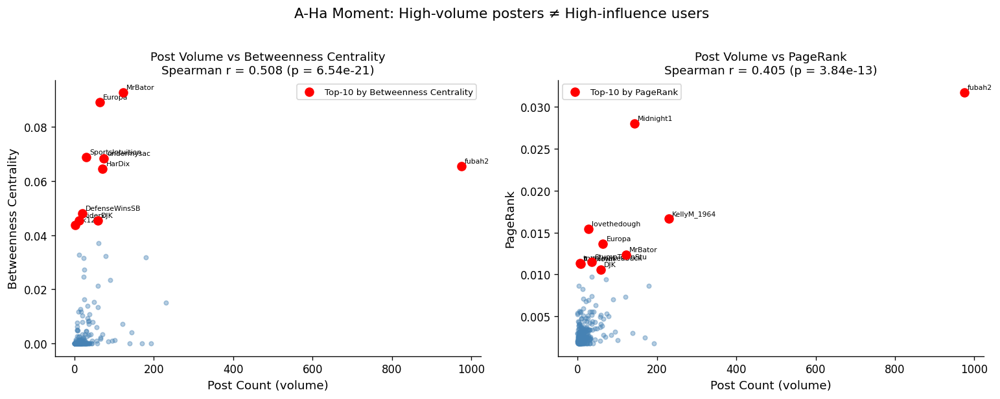
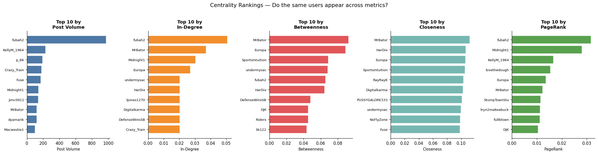
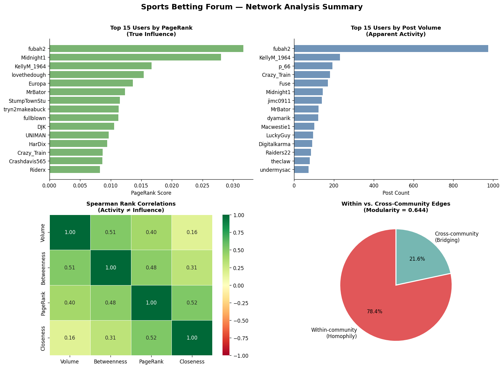

# Sports Betting Influence Network Analysis
### Social Media Analytics — Network Analysis Project

> **Core Question:** In an online sports betting community, who *actually* shapes opinion — and is it the same as who posts the most?

---

## Overview

This project applies network analysis to the [Covers.com](https://www.covers.com/) sports betting forum to identify true opinion leaders versus high-volume posters. Using directed interaction graphs, centrality metrics, community detection, and homophily analysis, we uncover the hidden influence structure of a 9,700+ post community spanning NFL, MLB, and NHL discussions.

**Key Finding:** Posting volume and network influence are only moderately correlated (Spearman r ≈ 0.40–0.51). The users who control information flow between communities are largely invisible if you're just counting posts.

---

## Visualizations

<p align="center">
  
  <br><em>Node color = Community &nbsp;|&nbsp; Node size = PageRank &nbsp;|&nbsp; Labeled = Top-15 by PageRank</em>
</p>

<p align="center">
  
</p>

<p align="center">
  
</p>

<p align="center">
  
</p>

---

## Data

| Field | Description |
|-------|-------------|
| `sport` | NFL, MLB, or NHL |
| `post_number` | Thread post index |
| `poster_name` | Forum username |
| `has_quote` | Whether the post quotes another user |
| `quoted_user` | The user being quoted (interaction signal) |
| `post_text` | Raw post content |

- **Source:** Scraped from Covers.com (NFL, MLB, NHL threads)
- **Scale:** ~9,700 posts · 778 unique users · 485 directed interactions (after cleaning)
- **Network logic:** Directed edge A → B when user A quotes user B. Edge weight = interaction frequency.

---

## Methodology

### 1. Network Construction
Built a directed, weighted `DiGraph` in NetworkX. Nodes are users; edges represent quote-reply interactions. Self-loops and null quoted users were removed.

**Network properties (largest connected component):**
- 297 nodes · 485 edges
- Density: 0.0055 (sparse — typical of social forums)
- Reciprocity: 0.214
- Degree assortativity: −0.169 (disassortative / hub-and-spoke structure)

### 2. Centrality Analysis
Four metrics computed to capture different dimensions of influence:

| Metric | Question it answers |
|--------|---------------------|
| **Degree** | Who has the most direct connections? |
| **Betweenness** | Who sits on the most shortest paths between others (bridge accounts)? |
| **Closeness** | Who can reach the rest of the network most quickly? |
| **PageRank** | Who is cited by other important users? |

### 3. Community Detection
Applied the **Louvain algorithm** (modularity optimization) on the undirected projection of the graph — no sport labels provided.

- **13 communities** detected
- **Modularity = 0.644** (anything above 0.3 is considered strong)
- Communities align naturally with sport preference, revealing sport-based echo chambers

### 4. Homophily vs. Social Influence
- **78.4% of edges are within-community** → homophily is the primary driver of community formation
- Followers of the top-5 PageRank users post significantly more than others (median 18 vs. 8 posts, Mann-Whitney p = 0.0014) → social influence is present but secondary

---

## Key Results

| Finding | Detail |
|---------|--------|
| Activity ≠ Influence | Post volume vs. betweenness Spearman r = 0.508; vs. PageRank r = 0.405 |
| Top bridge user | **MrBator** — highest betweenness, barely appears in volume rankings |
| Top overall influencer | **fubah2** — leads both PageRank and post volume |
| Community strength | Modularity 0.644 · 13 communities · sport-aligned echo chambers |
| Dominant force | Homophily (78.4% within-community edges) |
| Influence signal | Followers of top influencers are 2× more active (p = 0.0014) |

---

## Business Implications

- **Content targeting:** Bridge users (high betweenness) spread information across clusters more effectively than high-volume posters — target them for sponsored content or outreach
- **Tout/scammer detection:** High out-degree + low betweenness is a detectable pattern for coordinated inauthentic behavior
- **Market efficiency:** Strong community isolation (modularity 0.644) limits free information flow between sharp and casual bettors, reducing wisdom-of-the-crowd effects

---

## Repository Structure

```
├── sports_betting_network_analysis_fixed.ipynb   # Full analysis notebook
├── covers_forum_posts_big data_250.csv           # Raw dataset
├── SMA Final Presentation.pptx                   # Slide deck (14 slides)
├── SMA Final Presentation Script (1).docx        # Full spoken presentation script
├── network_viz_community_colored.png             # Network graph colored by community
├── centrality_rankings_top10.png                 # Top-10 users across all centrality metrics
├── volume_vs_influence_scatter.png               # Post volume vs. betweenness & PageRank
└── final_summary_4panel.png                      # 4-panel summary figure
```

---

## Dependencies

```bash
pip install networkx python-louvain matplotlib seaborn pandas numpy scipy
```

*OM386 Social Media Analytics — University of Texas at Austin*
